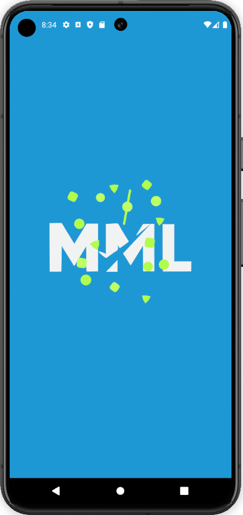
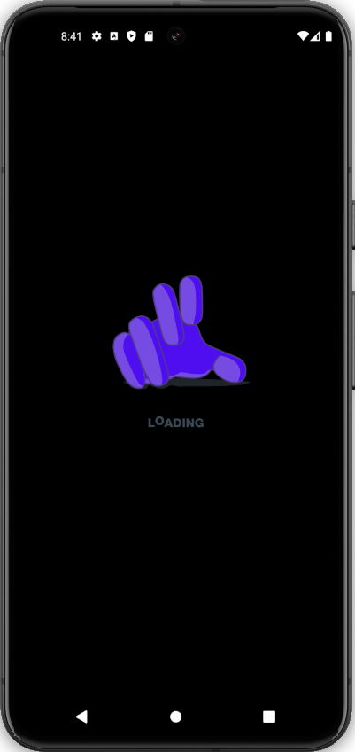
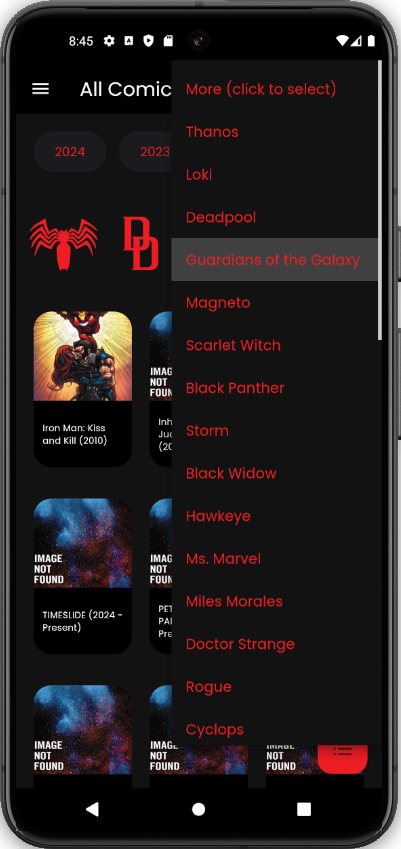
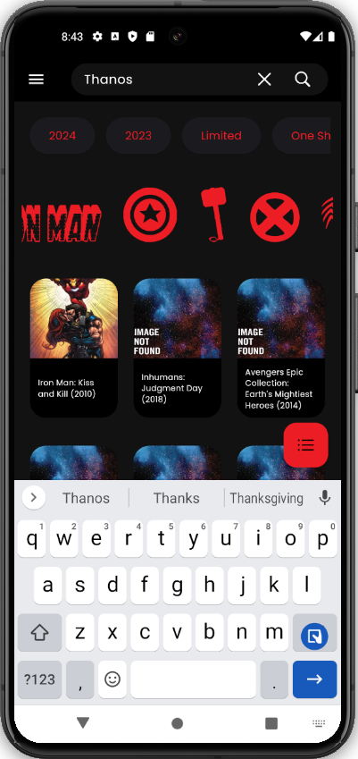
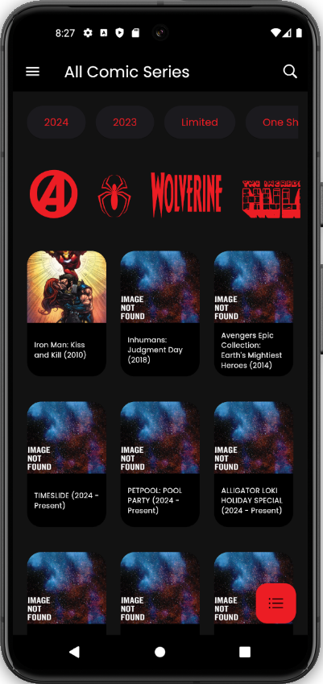
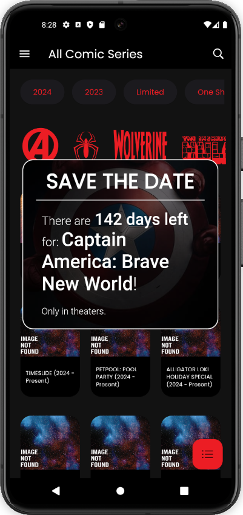
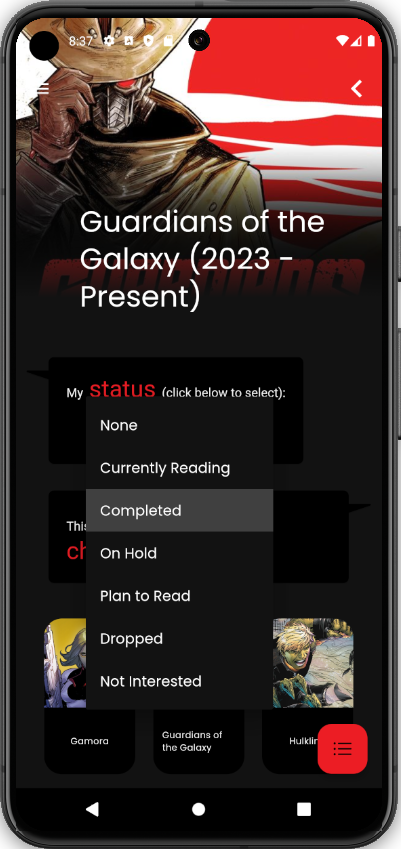
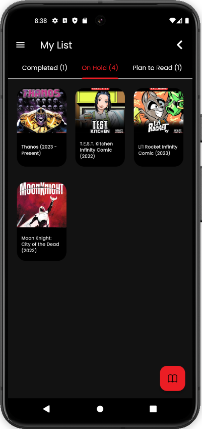
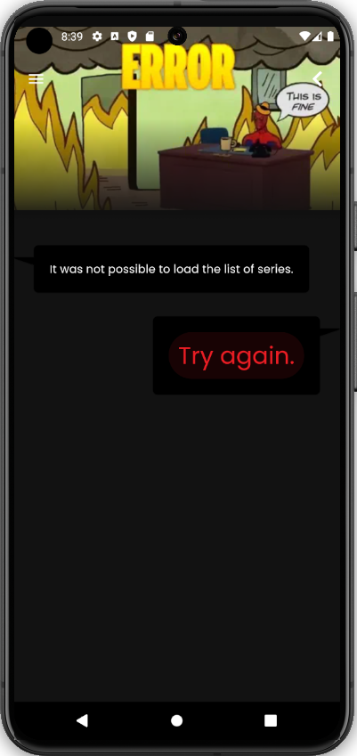

# About this project

This project is a delivery of an exercise related to a course on Flutter. It is an app for creating lists of comic
series organized by status. The goal of the exercise is to put into practice what has been learned in the course. Most
of the decisions and limitations of this project were driven by what the exercise asked for, my knowledge of Flutter
limited to the basics, and the deadline.

## An app to keep track of the comic series you have read

As the logo and name of the app suggest, this app was inspired by the MyDramaList app, which is an app that is used to
assign status to series, allowing users to keep track of which series they have already watched or intend to watch . Due
to the deadline, only status saving was implemented.

# Testing notes

## Emulation

Most of the time I used the Pixel 8 API 30 Android emulator for testing. This is the most recommended emulator to test
this app.

## Screen choices

The chosen option (between the two proposed options in the statement) is to first show the list of series and then show
the list of characters in the detail screen.

I like the idea of organizing series or character cards into three cards per row for portrait and five cards per row for
landscape. So the space inside a card is more limited and tooltips (which are shown when long pressing the cards) are
used to show additional information (e.g. description).

For the requested start year field, I'm assuming it is already contained in the title, so I didn't use the startYear
field that comes in the API response.

## Series Selection screen

When the user opens the app, a splash screen in lottie animation is shown.

The loading is also a lottie animation.

The first screen is capable of showing all series as requested, but additional features have also been developed for it.

The series are loaded in chunks of 15 and the loading of more series is triggered when scrolling to the end of the
page (infinite scroll).

The screen also contains filter buttons at the top and a text search option for easier navigation. For character
filters, scrolling all the way to the right after the icons there is a dropdown button with even more character options
to select.

The search bar is based on the YouTube search bar and has similar behavior (except it doesn't show
suggestions).

The series are ordered by the query "orderBy=-modified", because it seemed like a good option to load faster
and at the same time bring relevant results (although it ends up showing more results that don't contain thumbnails).
Initially I thought about using "orderBy=-startYear,-modified", but I was worried about the loading time.

There is also a toast that shows how many days are left until the next MCU film, which is shown after the splash screen.
This toast uses the "When is the next MCU film?" API.

## Series Details screen

The Series Details screen shows the characters in pieces of 15 and also uses the infinite scroll to load more. The
characters are shown ordered by name.

Below the title, a dropdown button was added for status selection. As soon as a status is selected it is automatically
saved. Due to the deadline, information is currently saved using the shared_preferences package. Unlike the previous
delivery, this time login and separation of data by users were not implemented.

## My List screen

The floating button with a checklist icon, present on almost all pages, navigates to the My List screen, where all
series that have an associated status can be consulted.

## Error screen

The statement also asked to display an error screen with a button to try again, in case there is an error when trying to
load information. One way to force this error screen to appear is to comment out lines 76, 77 and 78 of the
lib/components/app_search_bar.dart file and click the magnifying glass twice to perform an empty text search (since the
API returns an error if you try to search for empty text).

## Flutter version

The Flutter version used is 3.24.3.
